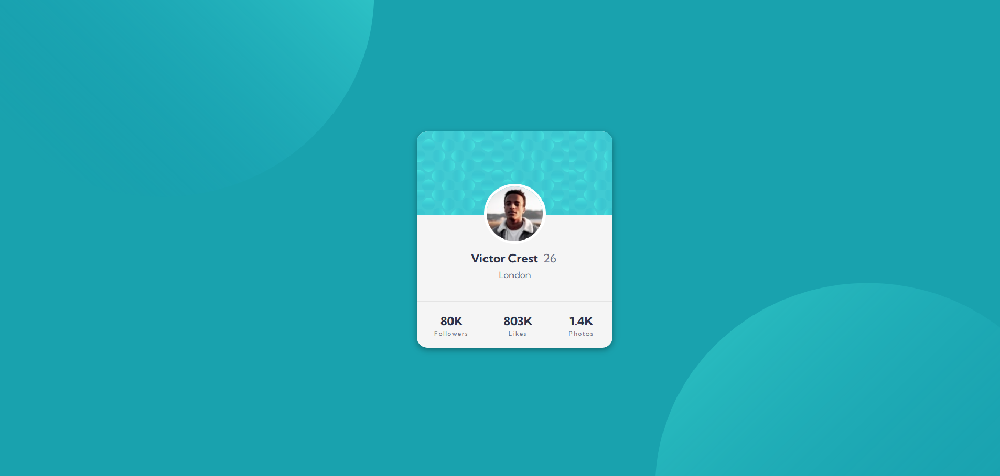
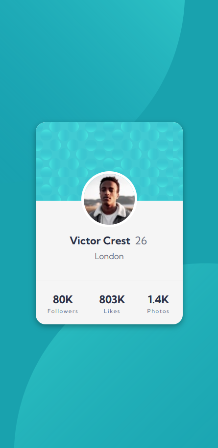

# Frontend Mentor - Profile card component solution IBendiburg

This is a solution to the [Profile card component challenge on Frontend Mentor](https://www.frontendmentor.io/challenges/profile-card-component-cfArpWshJ). Frontend Mentor challenges help you improve your coding skills by building realistic projects. The purpose of building this component is to practice HTML/CSS skills as well as technologies such as SVG and Flexbox.

## Table of contents

- [Overview](#overview)
  - [The challenge](#the-challenge)
  - [Screenshots](#screenshots)
  - [Links](#links)
- [My process](#my-process)
  - [Built with](#built-with)
  - [What I learned](#what-i-learned)
  - [Continued development](#continued-development)
- [Author](#author)


## Overview

### The challenge

- Build out the project to the designs provided
- Utilize SVG imgaes for your background.
- Accomodate all items using Flexbox or Grid.

### Screenshots





### Links

- Solution URL: [Add solution URL here](https://your-solution-url.com) [INCOMPLETE]
- Live Site URL: [Add live site URL here](https://your-live-site-url.com)[INCOMPLETE]

## My process

### Built with

- Semantic HTML5 markup
- CSS custom properties
- Flexbox
- CSS Grid
- Mobile-first workflow


### What I learned

This project has served as a great way to practice my positioning skills. WE had to use Absolute positioning to position the Profile picture as shown below:

```css
.card-content img{
    position: absolute;
    border-radius: 100%;
    border: 7px solid white;
    top: -150px;
    width: 130px;
}
```
Another really interesting implementation was to add the Circles in the background, then we use Relative positioning so they end up behind the Card component.

```html
<div class="circle">
    
    
</div>
```
This Div is the one that adds both the top and bottom circle and then we simply use top bottom left and right to position them accordingly on CSS.

```css
.circle .c1 {
    transition: all 0.3s ease 0s;

    top: -500px;
    left: -500px;
}

.circle .c2 {
    transition: all 0.3s ease 0s;

    bottom: -500px;
    right: -450px;
    
}
```

Everything else is simply making sure that the items inside the card component fits and has the appropiate format, the card was divided in Header, Body and Footer each containing the requiered information. 

### Continued development

We could further develop this component with using a data.json to retrieve the information needed and use React to build a more usefull component.


## Author

- Github - [Ibendiburg](https://github.com/ibendiburg)
- CodeWars - [Code Wars Account](https://www.codewars.com/users/ibendiburg)


